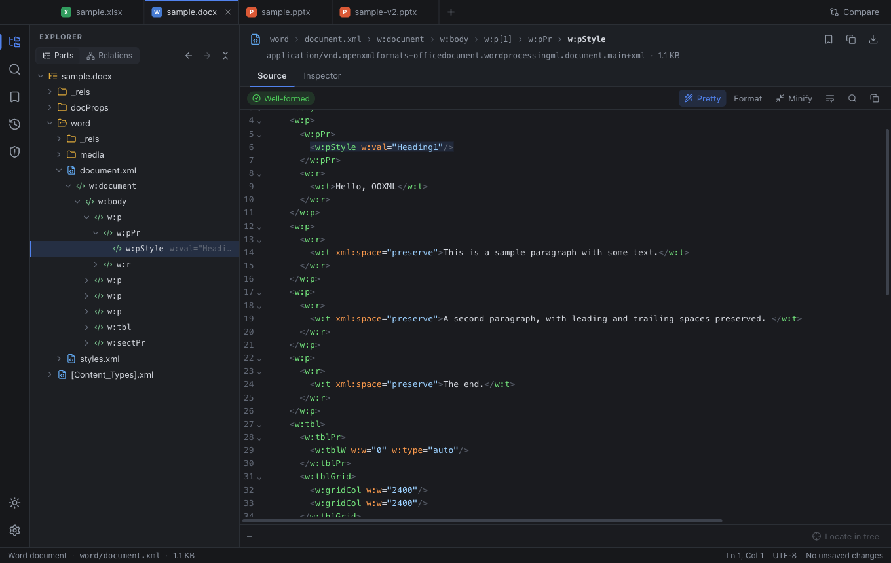
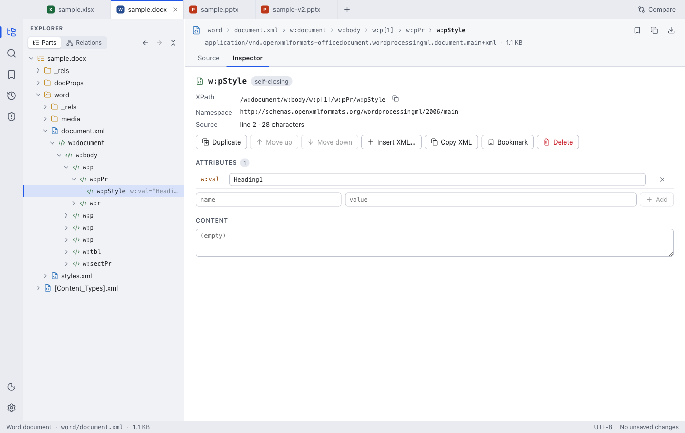
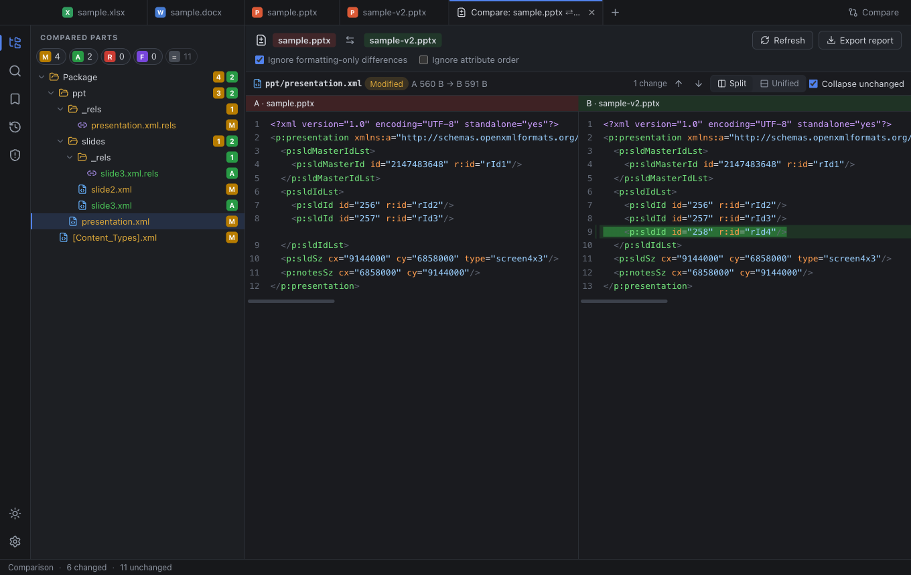
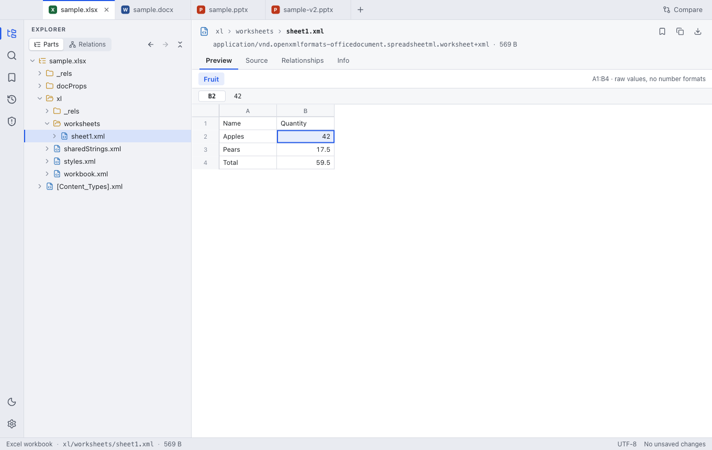

# OOXML Toolkit

A cross-platform desktop app (macOS, Windows, Linux) for **viewing, editing and comparing OOXML
packages** — `.docx`, `.xlsx`, `.pptx` and their macro/template variants (`.docm`, `.xlsm`, `.pptm`,
`.dotx`, `.xltx`, `.potx`, …). Basic support for ODF packages (`.odt`, `.ods`, `.odp`) and plain ZIP
files comes for free, because they are ZIP + XML as well.



<table>
  <tr>
    <td></td>
    <td></td>
  </tr>
  <tr>
    <td></td>
    <td></td>
  </tr>
</table>

## Features

**Tree on the left, details on the right**

- *Parts* view: the package's folder structure; every XML part expands lazily down to its elements
  (huge sheets are paginated, so a 250 000-row worksheet stays responsive).
- *Relations* view: the logical graph, following `.rels` files from the package root, with
  unreferenced parts collected in their own group.
- Breadcrumb for the selection, back/forward navigation, keyboard navigation in the tree.

**Viewing**

- Syntax-highlighted source with folding and in-part search. XML is shown re-indented, but the
  formatter only touches ignorable whitespace — text content is never altered.
- Content previews: worksheet grid with formula bar (XLSX), text outline (DOCX), slide rendering with
  shapes, pictures, tables and notes (PPTX).
- Image preview, hex view for binary parts, relationship tables (incoming and outgoing), part info
  (content type, sizes, CRC-32, SHA-256, encoding).
- **Package check**: malformed XML (with line/column), dangling relationships, parts without a content
  type, content-type overrides for missing parts, unreferenced parts.

**Editing**

- Edit the XML in the editor, or use the **inspector** to edit attributes and text, add attributes,
  duplicate, delete, move (e.g. reorder slides) and insert elements. Edits are exact text splices —
  the rest of the file stays byte-for-byte identical.
- Add, replace, export, rename (relationships and content types are updated) and delete parts.
- Undo/redo across all of the above; open embedded packages as their own document.
- **Saving only rewrites what changed**: untouched parts are copied with their original compressed
  bytes. Atomic writes, optional `.bak` copy, warning before saving malformed XML.

**Comparing**

- Compare two files, or review your unsaved edits against the version on disk.
- Part-level status (added / removed / modified / formatting-only) with folder roll-ups and filters.
- Side-by-side or unified XML diff, optionally ignoring formatting and attribute order; image
  comparison; export the result as a Markdown report.

**Productivity**

- Bookmarks for parts and individual elements (with notes), recent-file history with pinning, and
  session restore.
- Full-text search across all parts (case / whole word / regex) and **XPath** queries.
- Quick open for parts (`Cmd/Ctrl+P`), light and dark themes, tabs, drag & drop, file associations.

### Keyboard shortcuts

| | macOS | Windows / Linux |
| --- | --- | --- |
| Open / Save / Save As | `⌘O` / `⌘S` / `⇧⌘S` | `Ctrl+O` / `Ctrl+S` / `Ctrl+Shift+S` |
| Go to part | `⌘P` | `Ctrl+P` |
| Search in package | `⇧⌘F` | `Ctrl+Shift+F` |
| Find in part | `⌘F` | `Ctrl+F` |
| Bookmark selection | `⌘D` | `Ctrl+D` |
| Compare files / review changes | `⇧⌘D` / `⌥⌘D` | `Ctrl+Shift+D` / `Ctrl+Alt+D` |
| Back / Forward | `⌘[` / `⌘]` | `Ctrl+[` / `Ctrl+]` |
| Undo / Redo | `⌘Z` / `⇧⌘Z` | `Ctrl+Z` / `Ctrl+Shift+Z` |

## Getting started

Requires Node.js 20+ and npm.

```bash
npm install
npm run dev         # start the Electron app with hot reload
npm run samples     # optional: generate sample .docx/.xlsx/.pptx files in ./samples
```

| Script | What it does |
| --- | --- |
| `npm run dev` | Electron app with hot reload |
| `npm run dev:web` | The same UI in a plain browser at http://localhost:5199 (no Electron; files via file picker / drag & drop) |
| `npm test` | Unit tests for the core library |
| `npm run typecheck` | Type-check main/preload and renderer |
| `npm run e2e` | Build, then drive the real Electron app with Playwright (open → edit → save → restore) |
| `npm run build` | Type-check and bundle into `out/` |
| `npm run pack` | Unpacked app for the current platform in `release/` |
| `npm run dist` | Installers / archives (dmg, zip, nsis, portable, AppImage) in `release/` |
| `npm run screenshots` | Regenerate the screenshots in `docs/screenshots` |
| `npm run icon` | Re-render `build/icon.png` from `build/icon.svg` |

Builds are unsigned by default. To sign and notarize on macOS remove `identity: null` from
`electron-builder.yml` and provide the usual `CSC_*` / `APPLE_*` environment variables; the CI workflow
in `.github/workflows/ci.yml` builds all three platforms.

## Architecture

```
src/
  core/       Framework-free logic (also used by the tests)
    zip/        ZIP reader/writer: lazy extraction, verbatim re-use of untouched entries
    xml/        offset-preserving parser, whitespace-safe formatter, element edits as text splices
    package/    PackageModel (overlay + undo history), OPC content types & relationships,
                part classification, folder tree, package validation
    compare/    part-level package diff
    preview/    worksheet / document / slide extraction
    search.ts   full-text search and fuzzy part matching
  main/       Electron main process: window, native menu, file access with a path allow-list,
              atomic writes, JSON storage for history / bookmarks / settings / session
  preload/    contextBridge API (sandboxed renderer, no Node access)
  shared/     Host API contract and the command registry (menu and shortcuts come from one list)
  renderer/   React + zustand UI, CodeMirror 6 editors; runs in Electron or a plain browser
tests/        Vitest unit tests        e2e/  Playwright-driven Electron tests and screenshots
```

Key ideas:

- **The original archive is never mutated.** Edits live in a per-part overlay; saving writes a new
  archive that re-uses the original compressed bytes of every unchanged entry. An open → save with no
  edits reproduces identical entries.
- **The XML parser keeps source offsets**, so selecting a node highlights its exact range in the
  editor and element edits are precise splices — quoting, entities, namespace prefixes and attribute
  order survive untouched.
- **One undo history per package**, with snapshots per part; typing is coalesced into single steps.
- The renderer talks to a small `HostApi`; Electron implements it with IPC, the browser build with
  file inputs, downloads and `localStorage`.

## Limitations

- Password-protected Office files are OLE compound files, not ZIP packages, and cannot be opened.
  Legacy binary formats (`.doc`, `.xls`, `.ppt`) and `.xlsb` content are not parsed.
- The package check verifies structure, not schemas: it will not tell you that an element is invalid
  according to the ECMA-376 schemas.
- The slide preview is a simplified rendering (positions, text, pictures, tables); fonts, fills,
  charts and SmartArt are not drawn. The worksheet preview shows raw values without number formats.
- ZIP64 archives can be read but are not written (archives must stay below 4 GiB / 65 535 entries).

## License

MIT — see [LICENSE](LICENSE).
