# OOXML Toolkit

[](https://github.com/DominikPalo/OOXML-Toolkit/actions/workflows/ci.yml)

A cross-platform desktop app (macOS, Windows, Linux) for **viewing, editing and comparing OOXML
packages** — `.docx`, `.xlsx`, `.pptx` and their macro/template variants (`.docm`, `.xlsm`, `.pptm`,
`.dotx`, `.xltx`, `.potx`, …). OpenDocument packages (`.odt`, `.ods`, `.odp`, …) and plain ZIP files
open as well, because they are ZIP + XML too — ODF files get their document properties, a manifest
view and an ODF-specific package check.

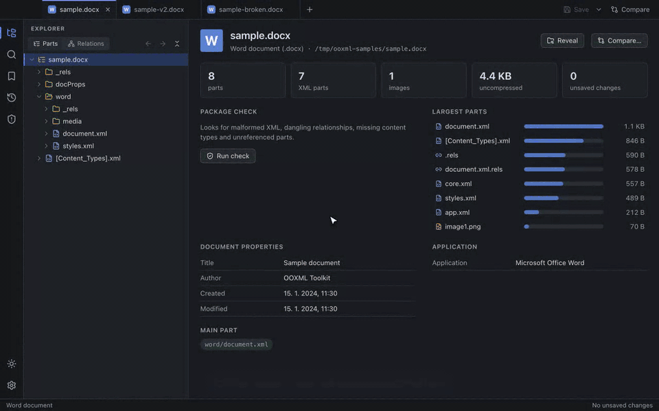

## Download

Grab the build for your system from the **[latest release](https://github.com/DominikPalo/OOXML-Toolkit/releases/latest)**:

| Platform | File |
| --- | --- |
| macOS — Apple Silicon / Intel | `OOXML-Toolkit-<version>-mac-arm64.dmg` / `…-mac-x64.dmg` |
| Windows 10/11 (64-bit) | `OOXML-Toolkit-<version>-win-x64-setup.exe` (installer) or `…-portable.exe` |
| Linux (64-bit) | `OOXML-Toolkit-<version>-linux-x86_64.AppImage` |

The builds are not notarized yet, so each system asks for a one-time confirmation on first launch:

- **macOS** — open the app once (macOS blocks it), then go to **System Settings → Privacy & Security**
  and click **Open Anyway**. On macOS 14 and earlier, right-click → **Open** works instead. In a terminal:
  `xattr -dr com.apple.quarantine "/Applications/OOXML Toolkit.app"`.
- **Windows** — SmartScreen: **More info → Run anyway**.
- **Linux** — `chmod +x` the AppImage (and install FUSE 2 if it does not start).

Details are in the [release notes](docs/releases/v0.3.0.md). Prefer to build it yourself? See
[Getting started](#getting-started).

## Highlights

- **A tree of the whole package on the left, details on the right** — folders, parts and every XML
  element, or the relationship graph.
- **Edit with confidence** — change XML in the editor or the inspector; every edit is undoable, and
  saving only rewrites the parts you touched (everything else stays byte-for-byte identical).
- **Compare** two files, or your unsaved edits against the saved file, down to a side-by-side XML diff.
- **Find things fast** — text / regex / XPath search across all parts, go-to-part, bookmarks and
  recent files.
- **Diagnose** broken packages: malformed XML, dangling relationships, missing content types.

## Getting started

To run from source you need **Node.js 24** (see `.nvmrc`; with nvm, `nvm use`) and npm.

```bash
npm install
npm run dev         # start the Electron app with hot reload
npm run samples     # optional: generate sample .docx/.xlsx/.pptx files in ./samples to play with
```

Open a file with **File → Open** (`⌘O` / `Ctrl+O`), drop it onto the window, or pass it on the command
line. See [Development](#development) for installers and the other scripts.

## Examples

The screenshots below were taken from the real app using the files in [`samples/`](samples)
(`npm run samples` creates them). A complete reference lives in the **[user guide](docs/guide.md)**.

### Tour of the window

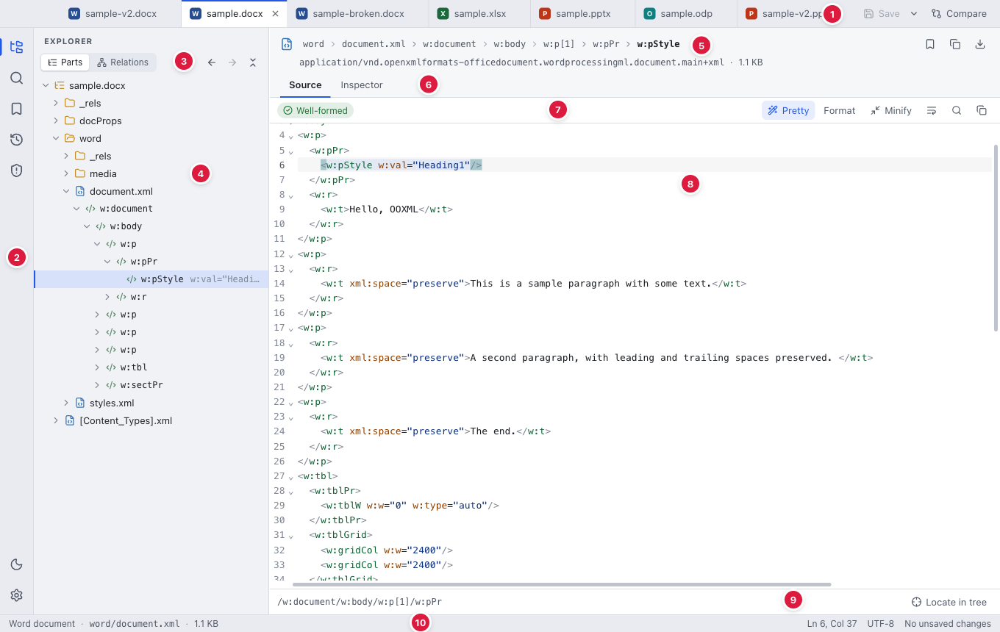

| | |
| --- | --- |
| **1** Tabs — open documents and comparisons (a dot means unsaved changes) | **6** Detail tabs — which ones appear depends on what is selected |
| **2** Activity bar — Explorer, Search, Bookmarks, Recent files, Package check | **7** Editor toolbar — validity, pretty-printing, format, wrap, find |
| **3** Tree mode (Parts / Relations), back / forward, collapse all | **8** Source editor, with the selected element highlighted |
| **4** The tree: folders → parts → XML elements | **9** XPath of the caret and *Locate in tree* |
| **5** Breadcrumb of the selection, bookmark / copy / export | **10** Status bar — type, part, size, caret, encoding, unsaved parts |

### 1. See what is inside a document

Open a file and click the root node of the tree. The overview shows how many parts the package has,
the largest ones, the document properties and a one-click package check.

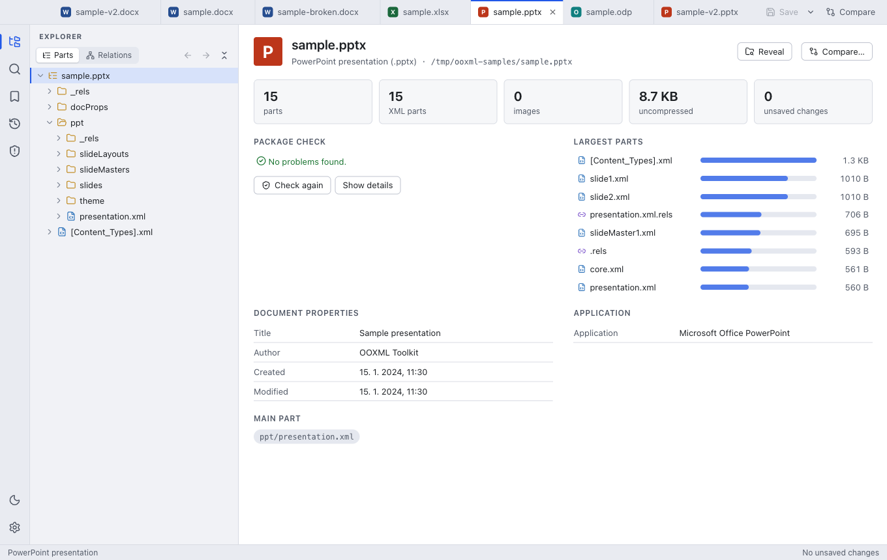

Expand folders and XML parts to drill down. Switch to **Relations** to follow the `.rels` graph the
way Office does — here from `presentation.xml` to its slides — and pick a slide to see it rendered.

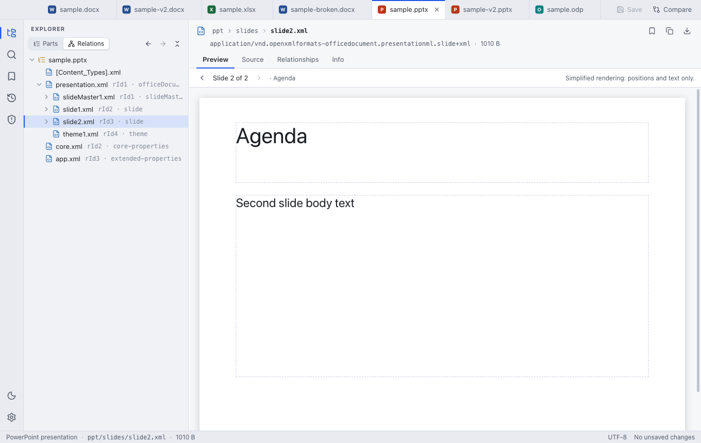

### 2. Find where some text lives

Press `⇧⌘F` / `Ctrl+Shift+F`, type what you are looking for, and click a hit: the part opens at the
match. Options for case, whole word and regular expressions sit inside the search box.

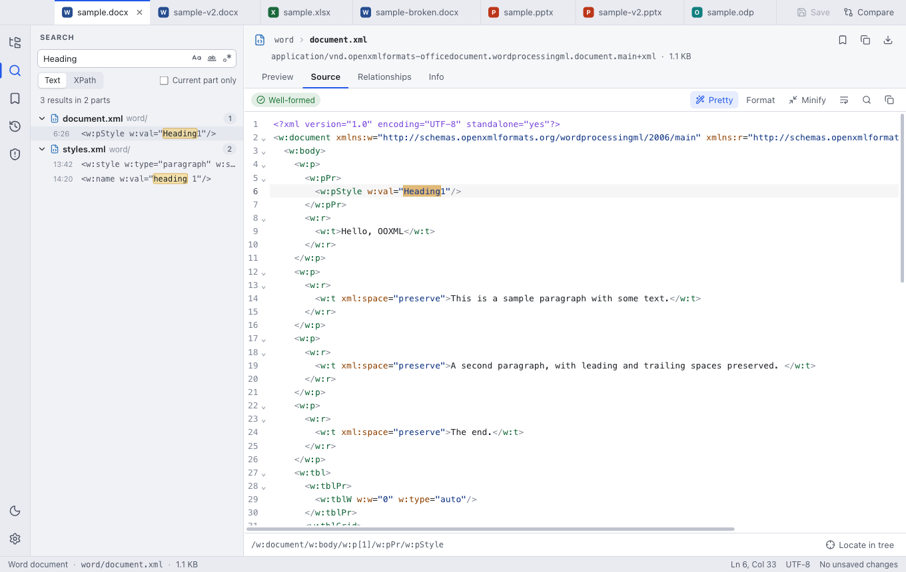

Switch to **XPath** for structural queries. Prefix `x:` addresses a default namespace — in a
worksheet, `//x:c[x:f]` finds every cell that contains a formula.

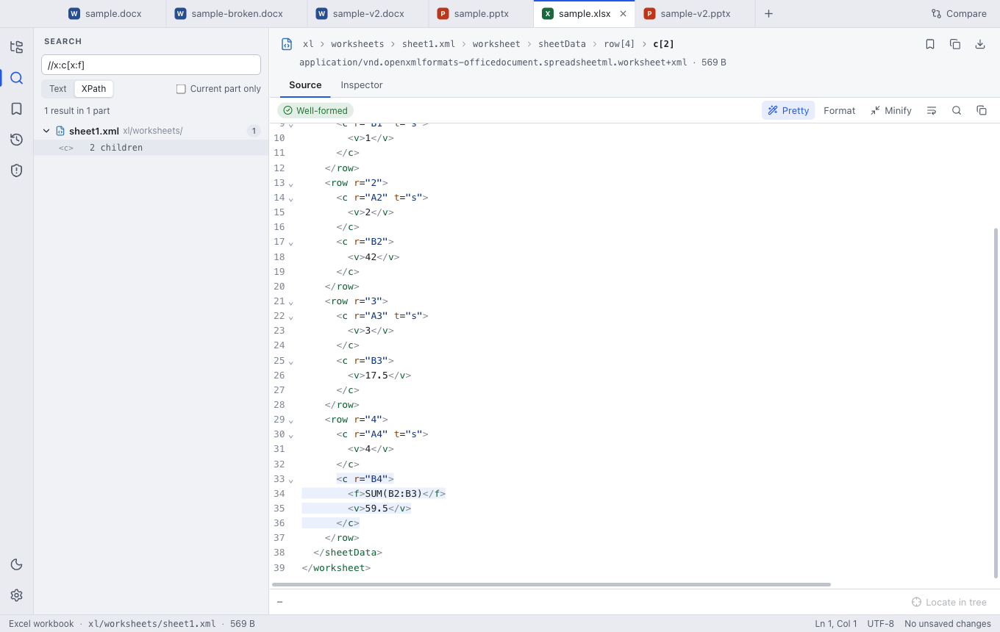

### 3. Change one thing — precisely

Select an element and open the **Inspector**: edit attribute values, add or remove attributes, edit
text, duplicate, move, delete or insert XML. Here the heading style `Heading1` becomes `Heading2`.
The tab shows a dot, the status bar counts the unsaved parts, and `⌘Z` / `Ctrl+Z` undoes it.

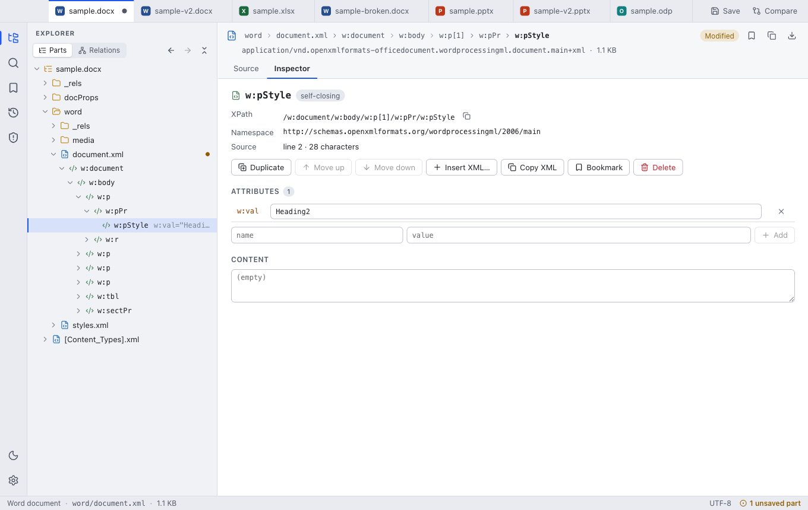

Prefer typing? The source editor is a full code editor with folding, find and syntax highlighting.
**Pretty** re-indents minified XML *for display only*; the file changes only when you actually edit.

### 4. Reorder slides (or any list of elements)

Slide order lives in `presentation.xml`. Right-click a `p:sldId` in the tree and choose **Move Down**.

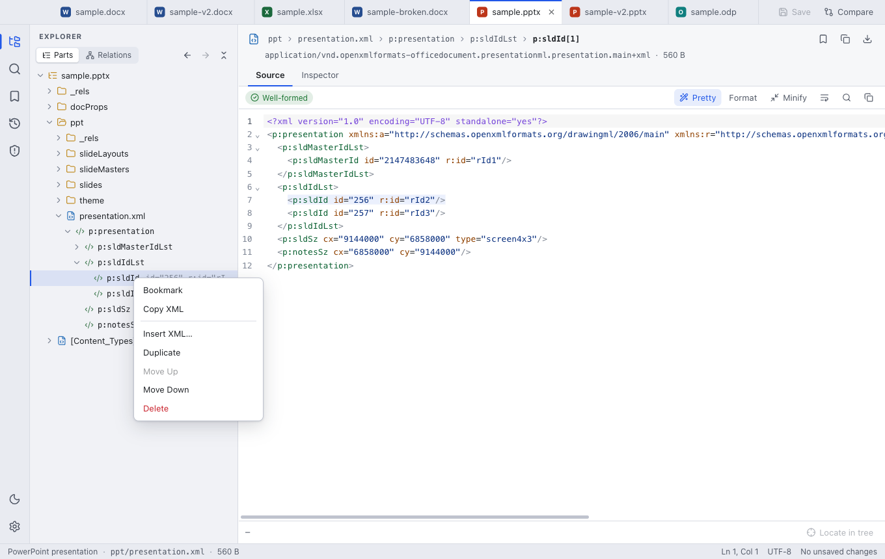

### 5. Review your edits before saving

On the overview (or via `⌥⌘D` / `Ctrl+Alt+D`) choose **Review changes** to compare the saved file with
your edited version. Two lines swapped — and nothing else touched:

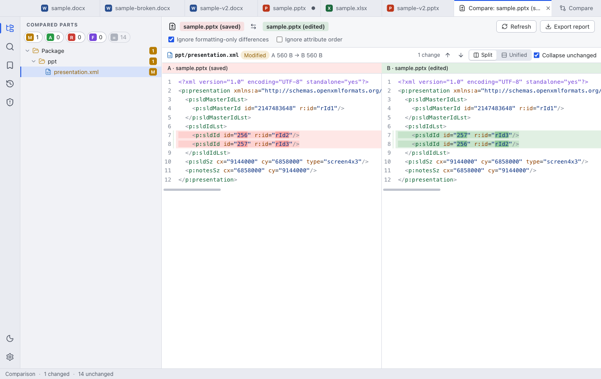

Saving (`⌘S`) then rewrites only `presentation.xml`; all other parts are copied unchanged.

### 6. Compare two versions of a document

Click **Compare** in the tab bar, pick the two files (open documents, recent files, or *Browse…*) and
press **Compare**.

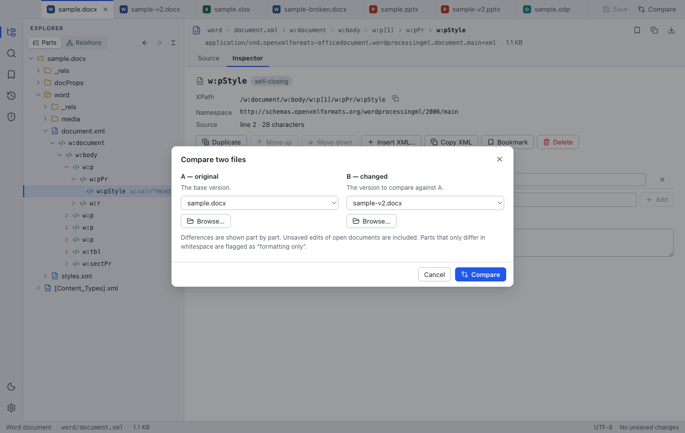

The tree lists every part with its status — **M**odified, **A**dded, **R**emoved, **F**ormatting-only —
and folder totals. Select a part to see the XML diff; switch between split and unified, step through
changes with the arrows, ignore formatting or attribute order, and export a Markdown report.

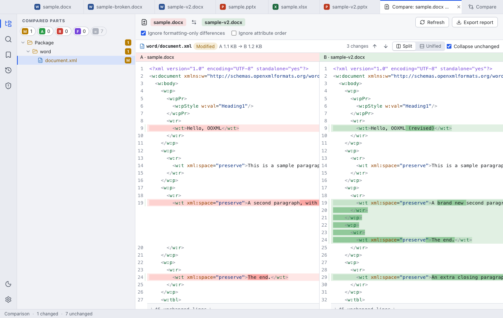

### 7. Find out why a file is broken

Open the **Package check** (`⇧⌘M` / `Ctrl+Shift+M`). It reports malformed XML (with line and column),
relationships that point nowhere, parts without a content type and parts nothing refers to. Click a
problem to jump to it.

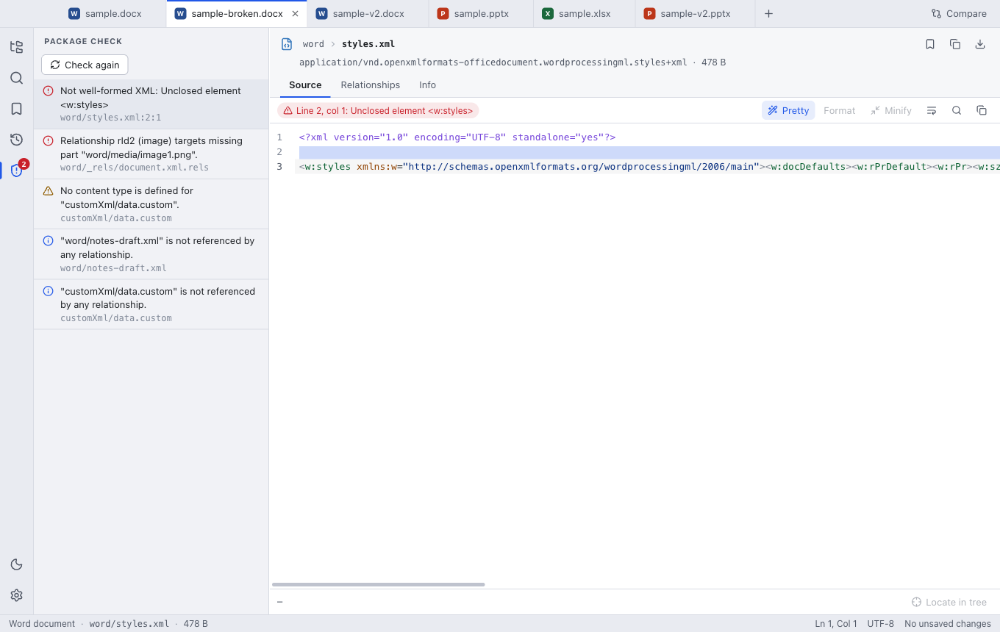

### 8. Look at the content, not just the XML

Worksheets, documents and slides have a **Preview** tab: a grid with a formula bar, a text outline,
and positioned shapes, pictures and notes. Images get one too — including **EMF** and **WMF**
metafiles, which are drawn as vector graphics (CAD and Visio exports, pasted Office charts).

| | |
| --- | --- |
| 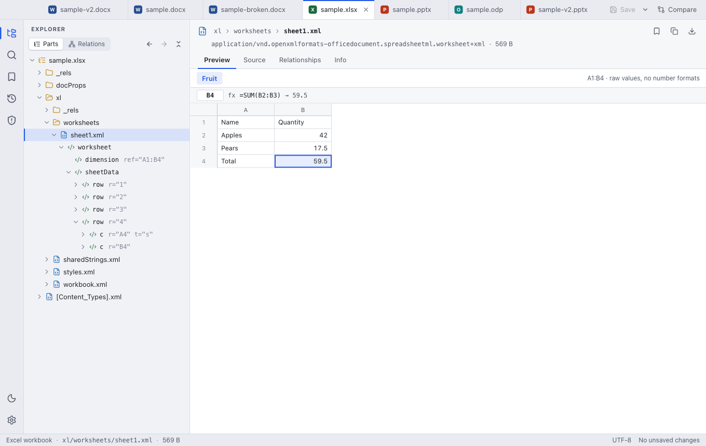 | 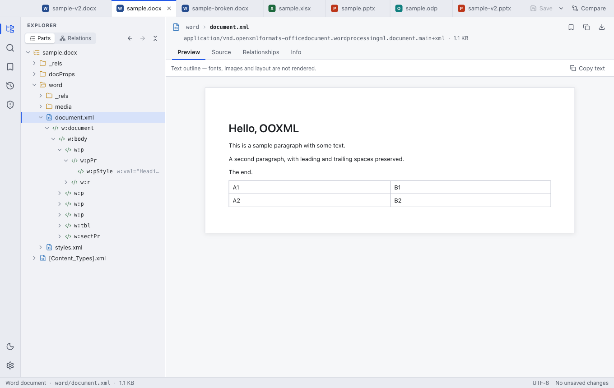 |

### 9. Jump around quickly

- `⌘P` / `Ctrl+P` — **go to part**: type a few letters of any part name.
- `⌘D` / `Ctrl+D` — **bookmark** the selected part or element. Bookmarks keep a name and a note and
  re-open their file when needed.
- Recent files are kept (pin your favourites) and the previous session is restored on start.

| | |
| --- | --- |
| 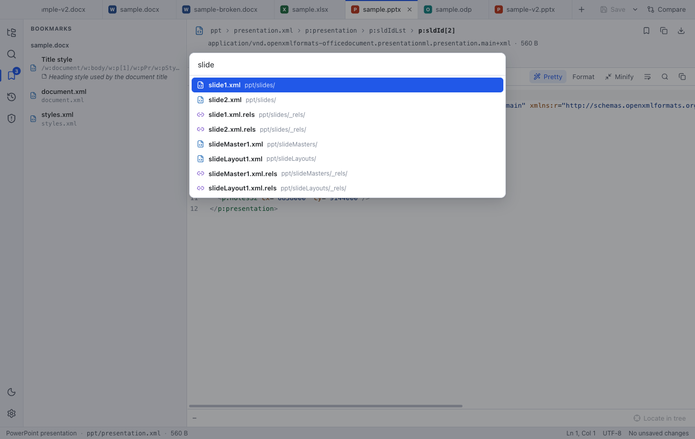 | 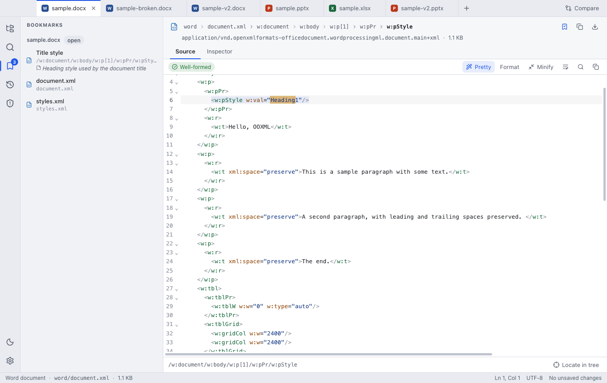 |

### 10. Open OpenDocument files too

`.odt`, `.ods`, `.odp` and the other ODF formats open like any other package. ODF has no relationships
or content types, so the app follows its own conventions instead:

- The **overview** reads `meta.xml` — title, author, keywords, dates, editing time, slide / page /
  word counts and any custom properties.
- **Manifest** (next to *Parts* in the explorer) lists every file in `META-INF/manifest.xml` with its
  media type, flags entries that point at a missing file and collects files the manifest does not list.
- Renaming or adding a part updates the manifest; `mimetype` is always saved first and uncompressed,
  as the format requires.
- The **package check** verifies the `mimetype` entry and compares the manifest with the actual parts.

| | |
| --- | --- |
| 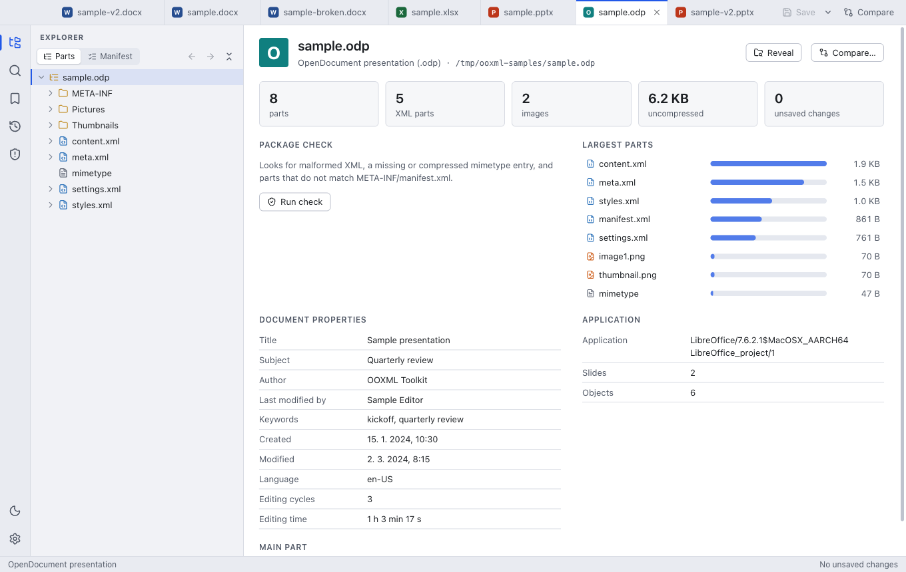 | 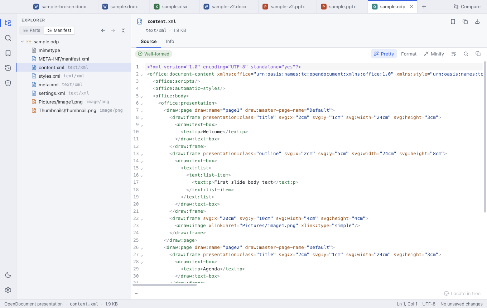 |

There are no slide, text or cell previews for ODF documents yet — you see (and edit) the XML.

## Features at a glance

**Viewing** — highlighted, foldable source; relationship tables (incoming and outgoing); image (PNG, SVG,
EMF, WMF, …) and hex views; part info (content type, sizes, CRC-32, SHA-256, encoding); open embedded packages as their own
document.

**Editing** — source editor, inspector, context-menu element operations; add, replace, export, rename
(relationships and content types are updated) and delete parts; undo/redo across everything;
atomic saves with an optional `.bak`; a warning before saving malformed XML.

**Comparing** — two files or unsaved changes; part-level status with folder roll-ups and filters;
split / unified diff; formatting-only differences detected; image comparison; Markdown report.

**Productivity** — search (text, regex, XPath), go-to-part, bookmarks, history, session restore, tabs,
drag & drop, file associations, light / dark / system theme.

### Keyboard shortcuts

| | macOS | Windows / Linux |
| --- | --- | --- |
| Open / Save / Save As | `⌘O` / `⌘S` / `⇧⌘S` | `Ctrl+O` / `Ctrl+S` / `Ctrl+Shift+S` |
| Go to part | `⌘P` | `Ctrl+P` |
| Search in package | `⇧⌘F` | `Ctrl+Shift+F` |
| Find in part | `⌘F` | `Ctrl+F` |
| Bookmark selection | `⌘D` | `Ctrl+D` |
| Compare files / review changes | `⇧⌘D` / `⌥⌘D` | `Ctrl+Shift+D` / `Ctrl+Alt+D` |
| Package check | `⇧⌘M` | `Ctrl+Shift+M` |
| Back / Forward | `⌘[` / `⌘]` | `Ctrl+[` / `Ctrl+]` |
| Undo / Redo | `⌘Z` / `⇧⌘Z` | `Ctrl+Z` / `Ctrl+Shift+Z` |
| Toggle side bar | `⌘B` | `Ctrl+B` |

More in the [user guide](docs/guide.md).

## Development

| Script | What it does |
| --- | --- |
| `npm run dev` | Electron app with hot reload |
| `npm run dev:web` | The same UI in a plain browser at http://localhost:5199 (no Electron; files via file picker / drag & drop) |
| `npm test` | Unit tests for the core library |
| `npm run typecheck` | Type-check main/preload and renderer |
| `npm run e2e` | Build, then drive the real Electron app with Playwright (open → edit → save → restore) |
| `npm run build` | Type-check and bundle into `out/` |
| `npm run pack` | Unpacked app for the current platform in `release/` |
| `npm run dist` | Installers / archives (dmg, zip, nsis, portable, AppImage) in `release/` |
| `npm run samples` | Generate the sample documents in `samples/` |
| `npm run screenshots` | Regenerate every screenshot in `docs/screenshots` |
| `npm run demo` | Re-record `docs/demo.gif` (needs `ffmpeg`) |
| `npm run icon` | Re-render `build/icon.png` from `build/icon.svg` |

The release workflow (`.github/workflows/release.yml`) builds all three platforms. Its macOS build is
signed with a Developer ID certificate and notarized by Apple, and fails if any of these is missing from
the repository settings. Secrets: `CSC_LINK` (the *Developer ID Application* certificate as a
base64-encoded `.p12`), `CSC_KEY_PASSWORD` and `APPLE_APP_SPECIFIC_PASSWORD`. Variables: `APPLE_ID` and
`APPLE_TEAM_ID`. Locally, `npm run pack` never signs. `npm run dist` signs
with whichever code-signing identity it finds in your keychain (use a Developer ID one for anything you
distribute) and notarizes when `APPLE_ID`, `APPLE_APP_SPECIFIC_PASSWORD` and `APPLE_TEAM_ID` are set; set
`CSC_IDENTITY_AUTO_DISCOVERY=false` to build the installers unsigned. Windows and Linux builds are
unsigned.

### Architecture

```
src/
  core/       Framework-free logic (also used by the tests)
    zip/        ZIP reader/writer: lazy extraction, verbatim re-use of untouched entries
    xml/        offset-preserving parser, whitespace-safe formatter, element edits as text splices
    package/    PackageModel (overlay + undo history), OPC content types & relationships,
                part classification, folder tree, package validation
    compare/    part-level package diff
    preview/    worksheet / document / slide extraction, EMF / WMF → SVG conversion
    search.ts   full-text search and fuzzy part matching
  main/       Electron main process: window, native menu, file access with a path allow-list,
              atomic writes, JSON storage for history / bookmarks / settings / session
  preload/    contextBridge API (sandboxed renderer, no Node access)
  shared/     Host API contract and the command registry (menu and shortcuts come from one list)
  renderer/   React + zustand UI, CodeMirror 6 editors; runs in Electron or a plain browser
tests/        Vitest unit tests        e2e/  Playwright-driven Electron tests, screenshots, demo
```

Key ideas:

- **The original archive is never mutated.** Edits live in a per-part overlay; saving writes a new
  archive that re-uses the original compressed bytes of every unchanged entry. An open → save with no
  edits reproduces identical entries.
- **The XML parser keeps source offsets**, so selecting a node highlights its exact range in the
  editor and element edits are precise splices — quoting, entities, namespace prefixes and attribute
  order survive untouched.
- **One undo history per package**, with snapshots per part; typing is coalesced into single steps.
- The renderer talks to a small `HostApi`; Electron implements it with IPC, the browser build with
  file inputs, downloads and `localStorage`.

## Limitations

- Password-protected Office files are OLE compound files, not ZIP packages, and cannot be opened.
  Legacy binary formats (`.doc`, `.xls`, `.ppt`) and `.xlsb` content are not parsed.
- The package check verifies structure, not schemas: it will not tell you that an element is invalid
  according to the ECMA-376 schemas.
- The slide preview is a simplified rendering (positions, text, pictures, tables); fonts, fills,
  charts and SmartArt are not drawn. The worksheet preview shows raw values without number formats.
- EMF / WMF previews are converted to SVG with [emf-converter](https://github.com/ChristopherVR/emf-converter):
  the picture is sized to the drawn content rather than to the header frame, and text uses the fonts
  installed on your machine. Very large metafiles (hundreds of thousands of records) take a moment.
- OpenDocument files have no slide, document or worksheet preview yet (the XML, properties, manifest
  and package check work). Encrypted ODF entries are listed but cannot be read.
- ZIP64 archives can be read but are not written (archives must stay below 4 GiB / 65 535 entries).

## License

MIT — see [LICENSE](LICENSE).
