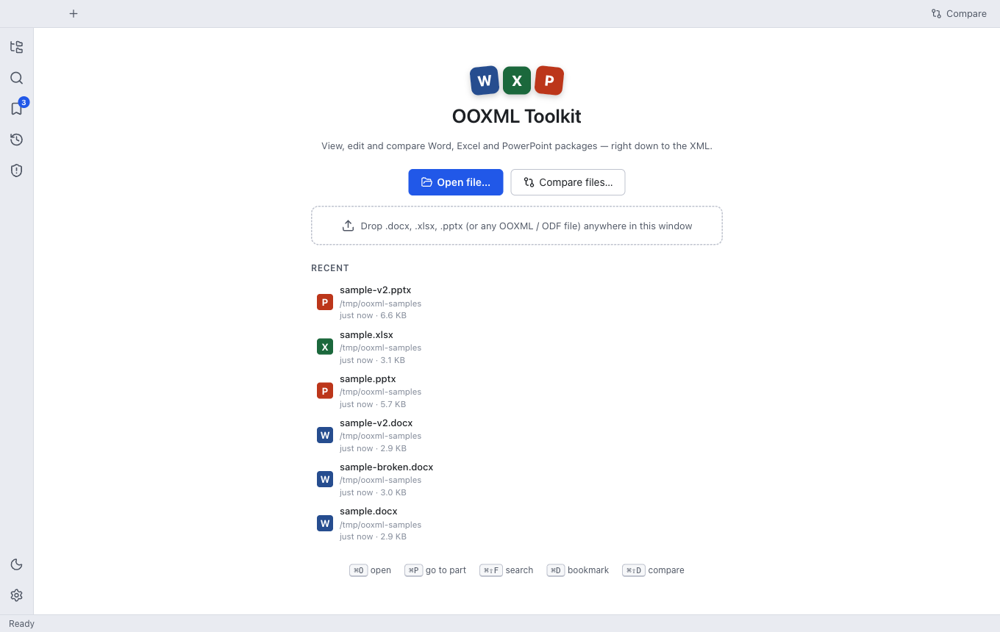
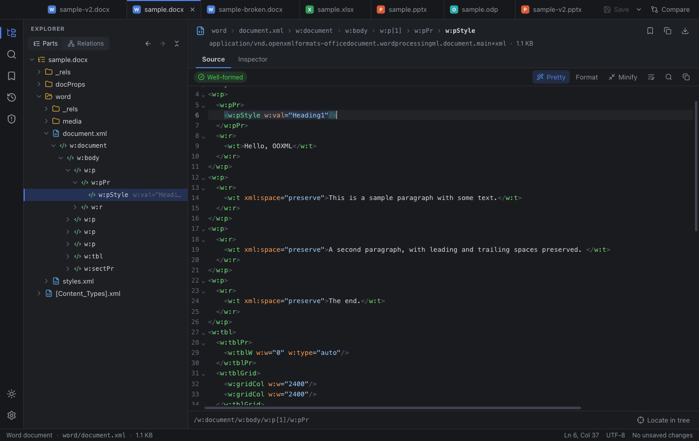
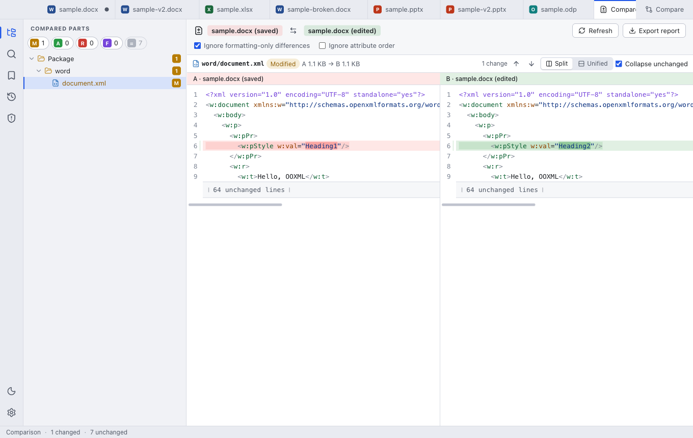
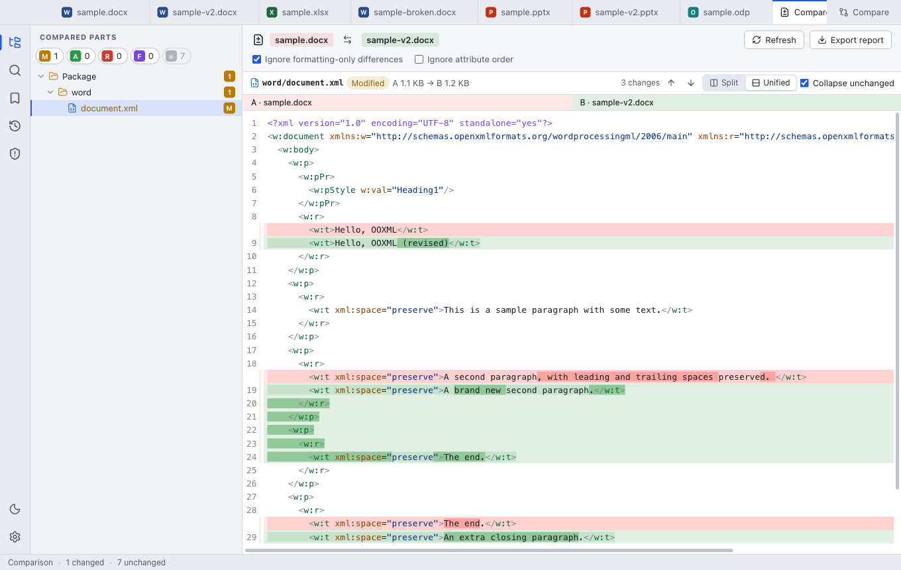
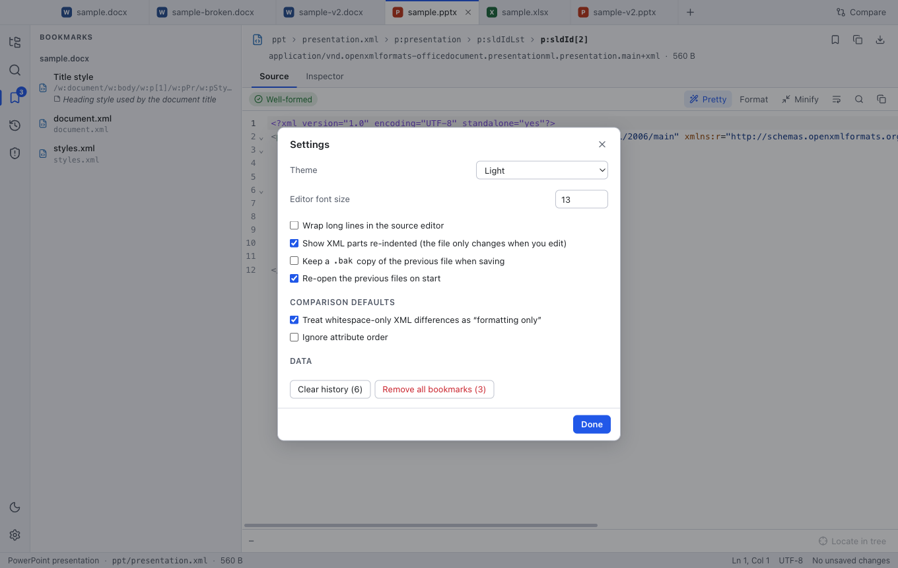

# OOXML Toolkit — user guide

This guide explains every part of the app. For a quick, example-driven introduction see the
[README](../README.md). The screenshots use the files in [`samples/`](../samples).

**Contents**

1. [Opening files](#1-opening-files)
2. [The window](#2-the-window)
3. [The tree](#3-the-tree)
4. [What you see for each selection](#4-what-you-see-for-each-selection)
5. [Editing](#5-editing)
6. [Saving and undo](#6-saving-and-undo)
7. [Searching](#7-searching)
8. [Comparing](#8-comparing)
9. [Package check](#9-package-check)
10. [Bookmarks, history and sessions](#10-bookmarks-history-and-sessions)
11. [Settings](#11-settings)
12. [Keyboard shortcuts](#12-keyboard-shortcuts)
13. [Troubleshooting and FAQ](#13-troubleshooting-and-faq)

---

## 1. Opening files

There are several ways to open a document:

- **File → Open…** (`⌘O` / `Ctrl+O`) or the **+** next to the tabs. You can select several files.
- **Drag & drop** files anywhere onto the window.
- **Recent files** — on the welcome screen, in the side bar (clock icon) or under **File → Open Recent**.
- **From the command line / file manager** — pass the paths as arguments, or use *Open with…* once the
  app is installed (it registers for `.docx`, `.xlsx`, `.pptx`, the macro/template variants, `.vsdx`
  and OpenDocument files). If the app is already running, the files open in the existing window.

Supported: Office Open XML (`.docx .docm .dotx .xlsx .xlsm .xltx .pptx .pptm .potx .ppsx …`), Visio
`.vsdx`, OpenDocument (`.odt .ods .odp .odg` and their templates — see
[OpenDocument files](#opendocument-files)) and any other ZIP file. Password-protected Office files and
legacy binary formats (`.doc`, `.xls`, `.ppt`) are not ZIP packages and cannot be opened.

Each file gets its own tab. A dot in place of the ✕ means the document has unsaved changes.

## 2. The window

| # | Area | What it does |
| --- | --- | --- |
| 1 | **Tabs** | One per open document or comparison. Middle-click or ✕ closes; the **Compare** button starts a comparison. |
| 2 | **Activity bar** | Switches the side bar between *Explorer*, *Search*, *Bookmarks*, *Recent files* and *Package check*. The moon / sun toggles the theme, the cog opens settings. Clicking the active icon hides the side bar (`⌘B` / `Ctrl+B`). |
| 3 | **Tree toolbar** | **Parts** ⇄ **Relations** mode, back / forward through your selection history, collapse all. |
| 4 | **Tree** | The package: folders, parts and XML elements. See [The tree](#3-the-tree). |
| 5 | **Breadcrumb** | Where you are. Click any crumb to select that folder, part or ancestor element. Buttons on the right bookmark the selection, copy its location and export the part. |
| 6 | **Detail tabs** | Depend on what is selected, see [section 4](#4-what-you-see-for-each-selection). |
| 7 | **Editor toolbar** | Well-formed badge, **Pretty / Format / Minify**, word wrap, find, copy. |
| 8 | **Source editor** | The XML of the part with the selected element highlighted. |
| 9 | **Caret path** | XPath of the element under the caret; **Locate in tree** selects it in the tree. |
| 10 | **Status bar** | Package type, selected part, size, caret position, encoding and the number of unsaved parts. |

The side bar can be resized by dragging its right edge (double-click resets the width).

## 3. The tree

### Parts mode

Folders and parts exactly as they are stored in the package, with `[Content_Types].xml`, `_rels` and
`docProps` first. XML parts and `.rels` files expand lazily into their elements. Elements show a hint:
the text of leaf elements (`Hello, OOXML`) or the most telling attributes (`r:id="rId2"`,
`w:val="Heading1"`, `name="Title 1"`). Elements with hundreds of thousands of children (worksheet rows)
are shown 200 at a time with a **N more…** row.

A coloured dot marks parts that were modified or added since the last save. A bookmark icon marks
bookmarked parts.

Keyboard: `↑ ↓` move, `→` expands (or steps into the first child), `←` collapses (or goes to the
parent), `Enter` toggles, `Home / End / PageUp / PageDown` jump.

### Relations mode

Follows the relationships (`.rels` files) starting at the package root, the way Office resolves a
document: `presentation.xml → slideMaster, slides, theme …`. Each row shows the target and
`relationship id · type`. External links, targets that do not exist (shown in red) and cycles are marked.
Parts that no chain of relationships reaches are collected under **Unreferenced parts**.

### Manifest mode (OpenDocument)

For OpenDocument packages the *Relations* button becomes **Manifest**. ODF has no relationships; the
tree lists `mimetype`, `META-INF/manifest.xml` and then every file entry of the manifest with its media
type. Entries that point at a file that is not in the package are shown in red, and files that exist but
are not listed are collected under **Not in manifest**. Encrypted entries are marked.

### Context menus

Right-click a row:

| Row | Actions |
| --- | --- |
| Package / group | Collapse all |
| Folder | Add file here…, copy path |
| Part | Bookmark, copy part name, **Export…**, **Open as package** (embedded `.docx/.xlsx/…`), **Replace content…**, **Rename…**, **Delete…** |
| Element | Bookmark, **Copy XML**, **Insert XML…**, **Duplicate**, **Move up / down**, **Delete** |

*Rename* updates every relationship that targets the part and its `[Content_Types].xml` override (in an
OpenDocument file: its entry in `META-INF/manifest.xml`); *Delete* leaves references alone on purpose
(the package check will list them) and can be undone.

## 4. What you see for each selection

| Selection | Tabs |
| --- | --- |
| Package (root) | **Overview** |
| Folder | List of contents with sizes |
| XML part | **Preview** (worksheets, the main document part, slides) · **Source** · **Relationships** (not in OpenDocument files) · **Info** |
| `.rels` part | **Table** · **Source** · **Info** |
| XML element | **Source** (highlighted) · **Inspector** |
| Image | **Preview** · **Hex** · **Info** (SVG also has **Source**; EMF and WMF are previewed too) |
| Text file | **Source** · **Hex** · **Info** |
| Embedded package | **Info** (with *Open as package*) · **Hex** |
| Other binary | **Hex** · **Info** |

**Overview** — part counts, largest parts, document properties (`docProps/core.xml` and `app.xml`; in
OpenDocument files `meta.xml`),
the main part, a package-check summary and, when you have edits, the list of unsaved changes with a
*Review changes* button.

**Previews**

- *Worksheet* — a grid with column letters, a formula bar (click a cell), sheet tabs (hidden sheets are
  marked) and the first 1 000 rows × 80 columns. Values are shown raw; number formats are not applied.
- *Word document* — a text outline: headings, paragraphs, lists and tables. Layout and fonts are not
  rendered. *Copy text* copies the whole body.
- *Slide* — shapes at their real positions, text, pictures and tables, plus speaker notes. Use ‹ › to
  step through the slides in presentation order. It is a simplified rendering.
- *Image* — scaled to fit or at 100 %. EMF and WMF metafiles (common in decks pasted from CAD, Visio or
  Excel) are replayed as vector graphics, so they stay sharp when zoomed; the toolbar says when a
  picture was rendered from a metafile. The same conversion is used for pictures in the slide preview
  and in the comparison view.

**Relationships tab** — outgoing relationships (declared by this part) and incoming ones (parts that
point at it). Click a row to go to the other end.

**Info** — content type, kind, size, compressed size, CRC-32, ZIP timestamp, text encoding, line count,
status, who refers to the part and an on-demand SHA-256.

### OpenDocument files

OpenDocument packages (`.odt`, `.ods`, `.odp`, `.odg`, their templates and `.odm`) are ZIP + XML like
OOXML, so most of the app works unchanged: tree, source editor, inspector, search, compare, bookmarks.
What differs:

- **Overview** shows the properties from `meta.xml`: title, subject, author, last editor, keywords,
  created / modified, language, editing cycles and time, custom properties, the generating
  application and the document statistics (slides, sheets or pages, objects, words, …).
- **Manifest** replaces *Relations* in the explorer (see [Manifest mode](#manifest-mode-opendocument)).
  The main part is `content.xml`.
- **Media types** shown for a part come from the manifest.
- **Add / rename** keep the manifest in sync; **delete** leaves its entry (like relationships in OOXML)
  and the package check reports it.
- `mimetype` is shown as text and always written first and stored uncompressed.

There are no slide, document or worksheet previews for OpenDocument yet.

## 5. Editing

### Source editor

A full code editor (CodeMirror 6): syntax highlighting, folding, bracket matching, find (`⌘F` /
`Ctrl+F`), indent with `Tab`.

- **Pretty** shows XML re-indented. This is a *view* only — nothing changes until you type. The
  formatter touches only insignificant whitespace between elements and never alters text, so it is safe
  for `xml:space="preserve"` content and mixed content.
- **Format** / **Minify** really rewrite the part (re-indent / remove ignorable whitespace).
- The badge shows **Well-formed** or the first error (click it to jump there). Malformed XML is allowed
  — useful when you are reproducing a corrupt-file bug — but you will be warned when saving.
- Once you edit a part in pretty view, the part is stored with the visible indentation. That is
  semantically identical XML; use **Minify** if you want the compact form back.

### Inspector

For the selected element: its name, XPath, namespace and source range; **Duplicate**, **Move up/down**,
**Insert XML…**, **Copy XML**, **Bookmark**, **Delete**; an editable table of **attributes** (press
`Enter` or leave the field to apply, `Esc` to revert, ✕ to remove, or add a new one); namespace
declarations; and the element's text content (leaf elements) or a summary of its children.

All inspector and tree operations are exact text splices: the rest of the part — quoting, entities,
prefixes, attribute order, whitespace — is left exactly as it was.

### Parts

Add a file as a new part (a `Default` content type is added for new extensions; in an OpenDocument file
a `file-entry` is added to the manifest), replace a part's
content with a file, export a part, rename or delete it — from the tree's context menu. Embedded
packages (e.g. a workbook embedded in a document) can be opened in their own tab.

## 6. Saving and undo

- **Save** (`⌘S` / `Ctrl+S`) writes the file in place, atomically (temporary file + rename).
  **Save As…** writes a copy and the tab continues with the new file.
- Only changed parts are re-compressed; every other entry is copied byte-for-byte from the original.
  Saving without edits reproduces the same entries.
- Optional **.bak** copy of the previous file (Settings).
- If edited XML parts are not well-formed you are asked before saving.
- **Undo / Redo** (`⌘Z` / `⇧⌘Z`) cover every edit — source, inspector, tree operations, part
  operations, renames. Typing is grouped into single steps. The history survives saving. It is capped
  at roughly 300 steps / 256 MB.
- Closing a tab or the window with unsaved changes asks whether to save, discard or cancel.

**Review changes** (`⌥⌘D` / `Ctrl+Alt+D`, or the button on the overview) compares the saved version
with your edits:

OpenDocument files keep their `mimetype` entry first and uncompressed when saved — a requirement of the
format that many generic ZIP tools get wrong.

In the browser build (`npm run dev:web`) *Save* downloads the file.

## 7. Searching

Open the search view with `⇧⌘F` / `Ctrl+Shift+F`. Results are grouped by part; click one to open the
part at that position.

**Text** — plain text, with toggles for **Aa** match case, **ab** whole word and **.\*** regular
expression (JavaScript syntax). Searching covers XML, `.rels` and text parts and sees the XML as it is
displayed, so line numbers match the editor. Results are limited to 2 000 hits.

**XPath** — XPath 1.0 over all XML parts. Prefixes declared on a part's root element work as written
(`//w:p[@w:rsidR]`, `//a:t`). XPath cannot address a *default* namespace, so the app also binds the prefix
`x` to it: in worksheets use `//x:c[x:f]` or `//x:row[@r='5']/x:c`. Hits can be elements, attributes
(`@name`) or text nodes; clicking one selects the element.

Tick **Current part only** to restrict either mode to the selected part. The query is remembered when
you switch tabs and re-run on the new document.

**Go to part** (`⌘P` / `Ctrl+P`) is a fuzzy finder for part names — `sldm` finds
`slideMasters/slideMaster1.xml`.

## 8. Comparing

Start a comparison from the **Compare** button (`⇧⌘D` / `Ctrl+Shift+D`) or from the overview.

Choose side **A** (the base) and **B** (the changed version) from the open documents, the recent files
or *Browse…*. Unsaved edits of open documents are included.

- The tree lists parts with a status badge — **M** modified, **A** added, **R** removed, **F**
  formatting-only, **=** unchanged — and per-folder counts. The chips above the tree filter by status.
- Selecting a part shows the diff of its XML. Both sides are pretty-printed first, so a reformatted
  file does not drown the real changes. Choose **Split** or **Unified**, collapse unchanged regions,
  and jump between changes with the arrows.
- **Ignore formatting-only differences** marks parts whose XML is equivalent as **F**. **Ignore
  attribute order** also normalises the order of attributes.
- Images (including EMF and WMF) are shown side by side; other binary parts show sizes and CRC-32.
- **Swap sides**, **Refresh** (re-reads live documents) and **Export report** (Markdown) are in the header.

## 9. Package check

`⇧⌘M` / `Ctrl+Shift+M`, or *Run check* on the overview.

| Severity | Finding |
| --- | --- |
| Error | Part is not well-formed XML (line and column) |
| Error | Relationship points at a part that does not exist |
| Error | Missing `[Content_Types].xml` or `_rels/.rels`, duplicate relationship ids, names differing only by case |
| Warning | Part without a content type; content-type override for a missing part; relationships for a missing part; no main document |
| Info | Part not referenced by any relationship |

For OpenDocument files the check applies the ODF packaging rules instead:

| Severity | Finding |
| --- | --- |
| Error | `mimetype` is missing, is not the first entry (folder entries count), or is compressed |
| Error | `META-INF/manifest.xml` is missing, is not a manifest, or lists a file that is not in the package |
| Warning | `mimetype` has trailing whitespace or disagrees with the manifest; a file is not listed in the manifest; no `content.xml` |
| Info | Encrypted entries (listed, but their content cannot be read) |

Parts that are not well-formed XML are reported for every kind of package.

The check looks at the package structure, not at ECMA-376 schema validity. Results are marked
*outdated* when the package has changed since the check ran.

## 10. Bookmarks, history and sessions

- **Bookmarks** — `⌘D` / `Ctrl+D` toggles a bookmark on the selected part or element (elements are
  stored as XPath, so they survive edits elsewhere in the part). The list is grouped by file; the open
  file comes first. Click to jump (the file is re-opened if necessary); the pencil edits the name and
  a note; the bin removes it.
- **Recent files** — every opened file is remembered with its type, size and time. Pin favourites,
  filter, reveal in the file manager, remove entries or clear the list (pins are kept).
- **Session restore** — the files that were open (and what was selected) come back on the next start.
  Turn it off in the settings.

History, bookmarks, settings and the session are stored as small JSON files in the app's user-data
folder (Electron's `userData`), or in `localStorage` in the browser build.

## 11. Settings

`⌘,` / `Ctrl+,` or the cog in the activity bar.

Theme (system / light / dark), editor font size, word wrap, pretty-printing, `.bak` on save, session
restore, comparison defaults, and buttons to clear the history or all bookmarks.

## 12. Keyboard shortcuts

| Action | macOS | Windows / Linux |
| --- | --- | --- |
| Open / Save / Save As | `⌘O` / `⌘S` / `⇧⌘S` | `Ctrl+O` / `Ctrl+S` / `Ctrl+Shift+S` |
| Close tab | `⌘W` | `Ctrl+W` |
| Next / previous tab | `⌃Tab` / `⌃⇧Tab` | `Ctrl+Tab` / `Ctrl+Shift+Tab` |
| Undo / Redo | `⌘Z` / `⇧⌘Z` | `Ctrl+Z` / `Ctrl+Shift+Z` |
| Find in part | `⌘F` | `Ctrl+F` |
| Search in package | `⇧⌘F` | `Ctrl+Shift+F` |
| Go to part | `⌘P` | `Ctrl+P` |
| Bookmark selection | `⌘D` | `Ctrl+D` |
| Format XML | `⌥⌘F` | `Ctrl+Alt+F` |
| Compare files | `⇧⌘D` | `Ctrl+Shift+D` |
| Review unsaved changes | `⌥⌘D` | `Ctrl+Alt+D` |
| Explorer / Bookmarks / Recent / Package check | `⇧⌘E` / `⇧⌘B` / `⇧⌘H` / `⇧⌘M` | `Ctrl+Shift+E` / `B` / `H` / `M` |
| Toggle side bar | `⌘B` | `Ctrl+B` |
| Back / Forward | `⌘[` / `⌘]` | `Ctrl+[` / `Ctrl+]` |
| Settings | `⌘,` | `Ctrl+,` |

## 13. Troubleshooting and FAQ

**The file says it is “not a valid ZIP-based package”.**
Office files that are password-protected or in a legacy binary format (`.doc`, `.xls`, `.ppt`) are not
ZIP archives. Save an unprotected copy in the current format (`.docx`, `.xlsx`, `.pptx`) first.

**macOS says the app is “damaged” or blocks it on first launch.**
The builds are not notarized (that needs a paid Apple Developer ID), so macOS quarantines the download.
Open the app once, then use **System Settings → Privacy & Security → Open Anyway** (macOS 14 and
earlier: right-click → **Open**). Or remove the quarantine flag in a terminal:
`xattr -dr com.apple.quarantine "/Applications/OOXML Toolkit.app"`. Version 0.1.0 had an invalid code
signature and showed the “damaged” message with no way forward — use 0.1.1 or later.

**Why does the XML look re-indented when the file is minified?**
That is the *Pretty* view. Turn it off in the editor toolbar (or the settings) to see the file exactly
as stored. The file itself is only changed when you edit.

**After I edited a part, the whole part got indented.**
You edited it in the pretty view, so the visible text is what gets stored. It is equivalent XML. Use
**Minify** to compact it again, or switch *Pretty* off *before* editing to keep the original layout.

**Is it safe to edit a file in place?**
Everything is undoable and saves are atomic. Untouched parts are copied byte-for-byte. For important
files enable *Keep a .bak copy* in the settings, or use *Save As…*.

**My XPath returns nothing.**
In XPath 1.0 an unprefixed name never matches a namespaced element. Use the prefixes that are declared
in the part (see its root element), or `x:` for the default namespace (worksheets, `[Content_Types].xml`,
`.rels` files): `//x:Override`, `//x:sheet`.

**How large a file can I open?**
Files are read lazily, so opening is fast even for large packages; a 44 MB worksheet XML (250 000 rows)
opens, expands and edits fine. Pretty-printing a part of that size takes a couple of seconds and shows a
“Preparing…” message while it works.

**Where is my data stored?**
History, bookmarks, settings and the session are plain JSON files in the app's user-data folder
(macOS `~/Library/Application Support/OOXML Toolkit`, Windows `%APPDATA%\OOXML Toolkit`, Linux
`~/.config/OOXML Toolkit`). The app never uploads anything.
